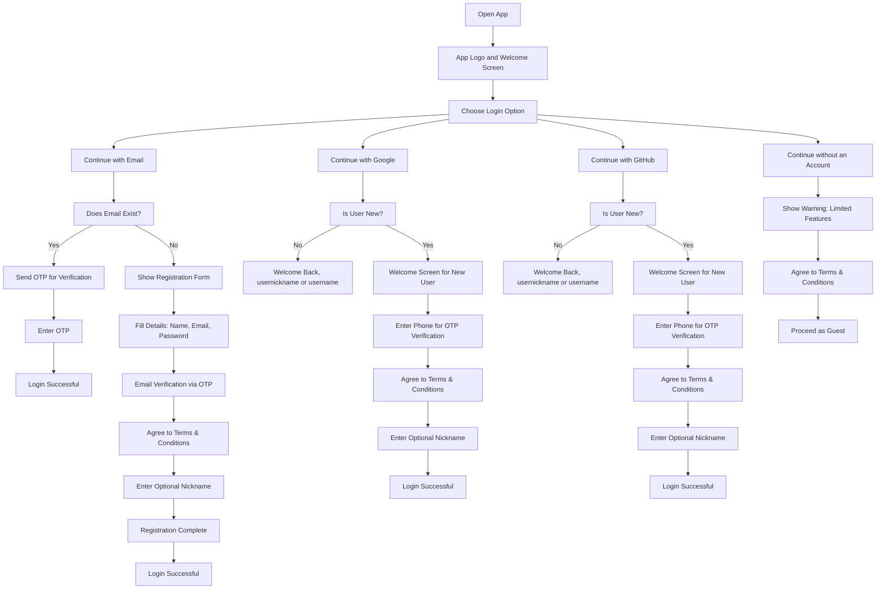

# **UX Flowchart - Resmart**

## **Login Process**

```mermaid
flowchart TD
    %% Main App Entry
    Start[Open App] --> Logo[App Logo and Welcome Screen]
    Logo --> LoginOptions[Choose Login Option]

    %% Login Options
    LoginOptions --> Email[Continue with Email]
    LoginOptions --> Google[Continue with Google]
    LoginOptions --> GitHub[Continue with GitHub]
    LoginOptions --> Guest[Continue without an Account]

    %% Email Login
    Email --> CheckEmail[Does Email Exist?]
    CheckEmail -->|Yes| SendOTP[Send OTP for Verification]
    SendOTP --> EnterOTP[Enter OTP]
    EnterOTP --> Verified[Login Successful]
    CheckEmail -->|No| EmailRegister[Show Registration Form]
    EmailRegister --> FillDetails[Fill Details: Name, Email, Password]
    FillDetails --> VerifyEmail[Email Verification via OTP]
    VerifyEmail --> AgreeTC1[Agree to Terms & Conditions]
    AgreeTC1 --> OptionalNick1[Enter Optional Nickname]
    OptionalNick1 --> CompleteReg1[Registration Complete]
    CompleteReg1 --> LoginSuccess1[Login Successful]

    %% Google Login
    Google --> CheckGoogle[Is User New?]
    CheckGoogle -->|No| GoogleLogin[Welcome Back, usernickname or username]
    CheckGoogle -->|Yes| GoogleRegister[Welcome Screen for New User]
    GoogleRegister --> PhoneVerification1[Enter Phone for OTP Verification]
    PhoneVerification1 --> AgreeTC2[Agree to Terms & Conditions]
    AgreeTC2 --> OptionalNick2[Enter Optional Nickname]
    OptionalNick2 --> GoogleLoginComplete[Login Successful]

    %% GitHub Login
    GitHub --> CheckGitHub[Is User New?]
    CheckGitHub -->|No| GitHubLogin[Welcome Back, usernickname or username]
    CheckGitHub -->|Yes| GitHubRegister[Welcome Screen for New User]
    GitHubRegister --> PhoneVerification2[Enter Phone for OTP Verification]
    PhoneVerification2 --> AgreeTC3[Agree to Terms & Conditions]
    AgreeTC3 --> OptionalNick3[Enter Optional Nickname]
    OptionalNick3 --> GitHubLoginComplete[Login Successful]

    %% Guest Access
    Guest --> GuestWarn[Show Warning: Limited Features]
    GuestWarn --> AgreeTC4[Agree to Terms & Conditions]
    AgreeTC4 --> GuestProceed[Proceed as Guest]
```